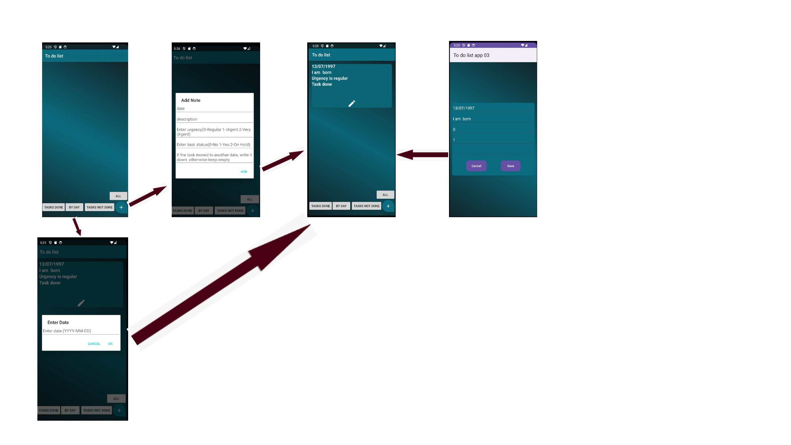

# TodoList Android Application

This is a simple **TodoList** Android application developed using **Java** that allows users to manage their tasks efficiently. It supports adding, updating, and deleting tasks, with an intuitive interface and multiple filtering options.

## Features

- **Add Tasks**: Users can easily add new tasks to their to-do list.
- **Update Tasks**: Existing tasks can be edited for better task management.
- **Delete Tasks**: Tasks can be removed from the list when no longer needed.
- **Task Filters**: 
  - View tasks that are **completed** or **not completed**.
  - Search tasks by **date**.
  - See all tasks in one place, with a simple and easy-to-use interface.

## Usage

1. **Add Task**: Click on the "+" button to add a new task. Fill in the task details and save.
2. **Update Task**: Click on any task in the list to edit its details, including its completion status.
3. **Delete Task**: Swipe left or right on a task to delete it.
4. **Search Tasks**: Use the search bar to filter tasks by:
   - **Completed tasks**
   - **Pending tasks**
   - **Tasks by date**
   - **View all tasks**

## Screenshot

Here is a screenshot of the application:



## How to Run

1. Clone this repository to your local machine:
   ```bash
   git clone https://github.com/haimhubara/AndroidTodoApp.git
